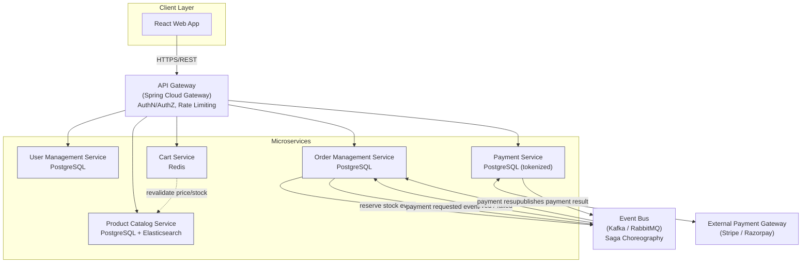

# Online Shopping System — Logical Architecture Diagram

AI-generated logical architecture diagram derived from `architecture.json`. Rendered with Mermaid (viewable in GitHub, VS Code with the Mermaid extension, or any Mermaid-compatible viewer).

## Notes

- **Contract-first**: every arrow between the Gateway and a service corresponds to an OpenAPI 3.0 contract (see `L1/UC2-Backend-API-Scaffolding`).
- **Saga, not 2PC**: Order Management orchestrates checkout via choreographed events on the bus rather than a distributed transaction, because Payment and Catalog are owned by independently deployable services (see `adr/ADR-001-microservices-vs-monolith.md`).
- **Cart is not authoritative**: price and stock shown in the cart are always revalidated against the Catalog service at checkout time to avoid stale-data risk.
- This diagram is the "AI-generated architecture diagram (logical)" deliverable required by USE CASE 1.
