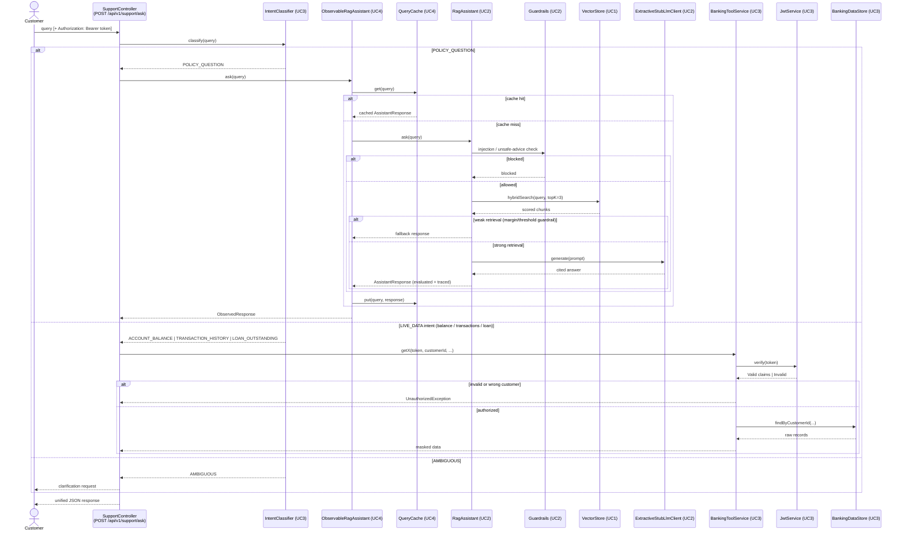
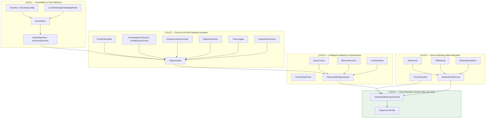

# Architecture Diagrams

Deliverable: "Architecture diagrams," per L2 HLD UseCase5. Two diagrams: the end-to-end request flow through the final integrated system, and the component/package map showing which L2 use case each piece came from.

## 1. Request flow (sequence)

## 2. Component map (which use case each piece came from)

Both diagrams describe `banking-support-core`'s `Main.java`/`SelfTests.java`, which actually exercises every path shown above — see `reports/integrated-demo-run-log.txt` for the real, corresponding output.
