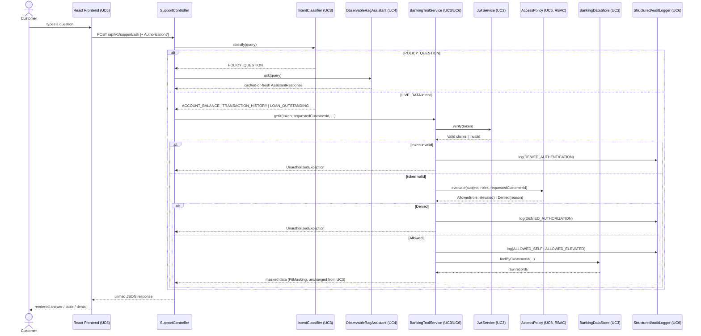
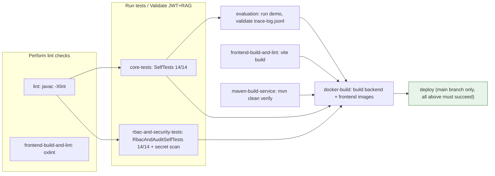

# Architecture Diagrams

Deliverable: "Architecture documentation & diagrams," per L2 HLD UseCase6. Extends L2/UC5's diagrams (`L2/UC5-Final-Integrated-System/diagrams/architecture-diagrams.md`) with this use case's two additions: the RBAC decision inside `BankingToolService`, and the CI/CD pipeline that gates deployment.

## 1. Request flow, with RBAC + audit logging (sequence)

## 2. CI/CD pipeline (job graph)

Every job in the left half of this graph (`lint`, `core-tests`, `rbac-and-security-tests`, `evaluation`, `frontend-build-and-lint`) runs commands that were **actually executed in this submission's sandbox** — see `banking-support-core/reports/` and `banking-support-frontend/reports/` for their real output. `maven-build-service` and `docker-build` need Maven Central / a Docker daemon this sandbox doesn't have; see `.github/workflows/ci-cd.yml`'s header comment and `cicd/README.md` for exactly what that means.
